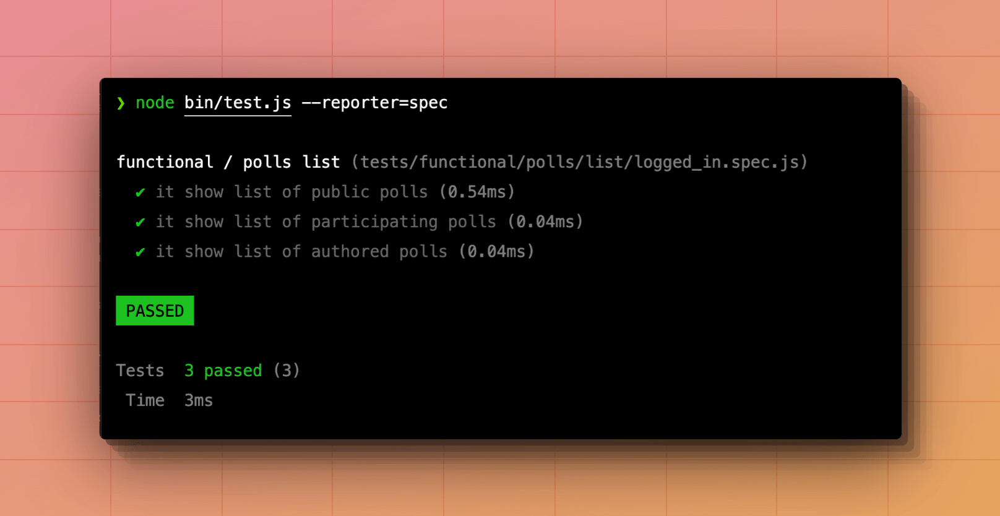
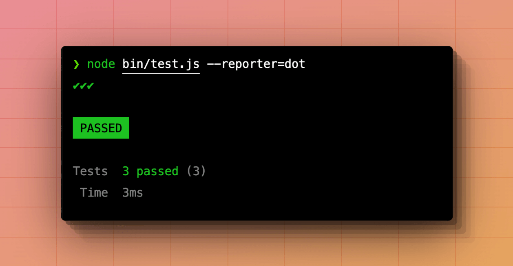

# Test reporters

Test reporters are used to collect test progress and display a summary after the tests have been executed.

A test reporter can choose the format and the destination where it wants to display the progress and the summary. For example, the [spec](#the-spec-reporter) reporter writes colorful ANSI output to the terminal.

## Registering and activating reporters

The reporters are registered within the Japa entry point file, i.e., `bin/test.js` using the `configure` method.

By default, the following reporters are registered inside the `list` array, and only the `spec` reporter is activated.

- [`spec`](#the-spec-reporter)
- [`dot`](#the-dot-reporter)
- [`ndjson`](#the-ndjson-reporter)

The defaults will be removed if you define the `reporters` property inside the configuration block. So, make sure to register and activate the reporters you want to use when configuring them manually.

```ts
import { configure } from '@japa/runner'
import * as reporters from '@japa/runner/reporters'

configure({
  reporters: {
    activated: [
      'spec'
    ],
    list: [
      reporters.spec(),
      reporters.ndjson(),
      reporters.dot(),
    ],
  }
})
```

## Activating using command-line

You can activate/switch between the reporters from the command line using the `--reporters` CLI flag. However, ensure the reporter is registered on the list before you can activate it.

```sh
node bin/test.js --reporters=dot
node bin/test.js --reporters=ndjson
```

You will get the following error if you try to activate a non-registered reporter.

```sh
node bin/test.js --reporters=list

# Error: Invalid reporter "list". Make sure to register it first inside the "reporters.list" array.
```

## The `spec` reporter

The `spec` reporter displays the test output in the terminal as a colorful output, as shown in the following screenshot. 



## The `dot` reporter

The `dot` reporter displays the test output only using the icons and without titles.



## The `ndjson` reporter

The `ndjson` reporter outputs each event as a valid JSON string to the terminal. The JSON output is an excellent fit for programmatic use cases.


## Creating a custom reporter

You can create and register custom test reporters with Japa. A test reporter must extend the `BaseReporter` class and register it as an object within the configuration block.

### Defining a reporter

Let's start by creating a reporter class. You can implement the following methods to listen for different events emitted during the test lifecycle.

See also: [BaseReporter source code](https://github.com/japa/runner/blob/next/modules/core/reporters/base.ts)

```ts
import { BaseReporter } from '@japa/runner/core'

class MyCustomReporter extends BaseReporter {
  static name = 'custom'

  onTestStart(testPayload) {
    console.log('test started "%s"', testPayload.title)
  }
  onTestEnd(testPayload) {
    console.log('test completed "%s"', testPayload.title)
  }

  onGroupStart(groupPayload) {
    console.log('group started "%s"', groupPayload.title)
  }
  onGroupEnd(groupPayload) {
    console.log('group ended "%s"', groupPayload.title)
  }

  onSuiteStart(suitePayload) {
    console.log('suite started "%s"', suitePayload.name)
  }
  onSuiteEnd(suitePayload) {
    console.log('suite completed "%s"', suitePayload.name)
  }

  async start() {
    console.log('starting')
  }
  async end() {
    console.log('completed')
  }
}
```

### Registering custom reporter

Once you have defined a custom reporter, register it in the Japa entry point file.

```ts
configure({
  reporters: {
    activated: [MyCustomReporter.name],
    list: [
      {
        name: MyCustomReporter.name,
        handler: (...args) => new MyCustomReporter().boot(...args),
      }
    ]
  }
})
```

### Accessing the test summary

Once all the tests have been executed, you can access the test summary within the `end` method using the `this.runner.getSummary` method.

```ts
class MyCustomReporter extends BaseReporter {
  async end() {
    const summary = await this.runner.getSummary()
    console.log(summary)
  }
}
```

The summary has the following properties.

```js
{
  aggregates: {
    total: 3,
    failed: 0,
    passed: 3,
    regression: 0,
    skipped: 0,
    todo: 0
  },
  hasError: false,
  duration: 4,
  failureTree: [],
  failedTestsTitles: []
}
```

<dl>

<dt>

hasError

</dt>

<dd>

A boolean to know if one or more errors occurred during the test lifecycle.

</dd>


<dt>

duration

</dt>

<dd>

The total of milliseconds spent between executing the first and the last test. This duration does not account for booting the Node.js process and importing the test files.

</dd>

<dt>

failureTree

</dt>

<dd>

A nested tree of errors containing information about the suite, group, and the test that raised the error. The top-level node will always be a suite. 

The `errors` property will hold the errors raised within the suite hooks (if any). Otherwise, you must loop over the children and check for nested errors.

```ts
{
  name: 'functional',
  type: 'suite',
  errors: [],
  children: [Array]
}
```

The children's array may contain objects for `type = group` or `type = test`. 

The `errors` property will hold the errors raised within the group hooks (if any). Otherwise, you must loop over the children to check for errors within tests.

```ts
{
  name: 'polls list',
  type: 'group',
  errors: [],
  children: [ [Object] ]
}
```

</dd>

<dt>

failedTestTitles

</dt>

<dd>

A flat array containing the titles for failed tests.

</dd>


<dt>

aggregates

</dt>

<dd>

An object with additional properties contains the number of total tests, failed tests, regression tests, etc.

</dd>


</dl>

### Printing the test summary

You may use the `this.printSummary` method to print the summary to the terminal with formatting and colors.

```ts
class MyCustomReporter extends BaseReporter {
  async end() {
    const summary = await this.runner.getSummary()
    await this.printSummary(summary)
  }
}
```
